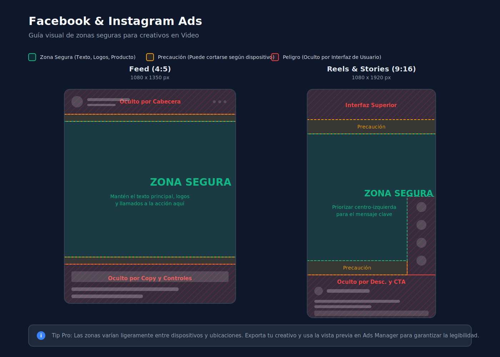

# Estrategias de Marketing

Planes y procesos para la promoción de la marca y las propiedades.

## Recursos relacionados

- [Sistema Modular de Ads para Propiedades](marketing/sistema-modular-de-ads.md): metodología para grabar una propiedad una sola vez y salir con una matriz de hooks, ángulos y pruebas.
- [Guiones de Ads para Propiedades](marketing/guiones-de-ads.md): plantillas reutilizables para anuncios con CTA hacia WhatsApp.

## Guía de video para Facebook Ads

Esta guía funciona como estándar interno para piezas de video que se publicarán en Facebook Ads y, cuando aplique, en ubicaciones equivalentes de Meta como Feed, Stories y Reels.

### Flujo recomendado

1. Definir placements y objetivo antes de editar la pieza final.
2. Producir la variante correcta para cada grupo de placement activo.
3. Exportar, nombrar y entregar los archivos con una convención consistente.
4. Validar previews, recortes y cobertura de texto dentro de Ads Manager antes de aprobar.

### Formato de archivo y relación de aspecto

- **Contenedor y códec:** exportar en `MP4`, vídeo `H.264`, audio `AAC`.
- **Resolución:** trabajar como mínimo en `1080p` en el eje largo de cada ratio (ver tabla).
- Si solo existirá **una** versión del anuncio, debe ser `4:5` (`1080 x 1350`).
- Si la campaña usará placements automáticos o mixtos, preparar **variantes nativas**; no subir un solo archivo esperando que Meta recorte bien en todos los formatos.
- Evitar depender de texto pequeño o detalles finos para comunicar el mensaje.

| Uso principal | Relación | Resolución mínima | Notas |
| --- | --- | --- | --- |
| Una sola versión para la campaña | `4:5` | `1080 x 1350` | Estándar interno por defecto |
| Feed móvil | `4:5` | `1080 x 1350` | Archivo principal si la campaña es solo Feed |
| Stories y Reels | `9:16` | `1080 x 1920` | Archivo principal si la campaña es solo Stories/Reels |
| Placements cuadrados | `1:1` | `1080 x 1080` | Variante cuando el mix lo requiera |
| Placements mixtos o Advantage+ | Varias | Según filas anteriores | Una pieza por grupo de placement, no una universal |

### Parámetros técnicos de exportación

Los límites exactos de Meta (peso máximo, duración máxima por ubicación) cambian; **confirmar siempre los valores vigentes** en la [guía de especificaciones de anuncios de Meta](https://www.facebook.com/business/ads-guide) antes de subir.

- **Bitrate (orientativo):** para piezas en `1080p` y duración típica de anuncio, rango orientativo de ~`10`–`20` Mbps en `H.264` con VBR; priorizar buena nitidez sin inflar el archivo sin necesidad.
- **FPS:** exportar a `24`, `25` o `30` fps de forma **coherente con el material de origen**; evitar mezclar distintos fps en la misma pieza sin una conversión a propósito.
- **Audio:** además de la normalización descrita más abajo, usar **48 kHz** de frecuencia de muestreo al exportar el `AAC` para reducir sorpresas entre programas de edición.
- **Antes de subir:** comprobar que duración y tamaño del archivo cumplen lo que indica el Ads Guide para el formato elegido.

### Asignación por placement y validación

- Para evitar avisos como "This ad will not show up on certain placements" o recortes automáticos, entregar una versión específica para cada grupo de placement activo.
- Entrega recomendada para campañas amplias de Meta: `9:16` para Stories/Reels, `4:5` para Feed y `1:1` solo cuando el mix realmente lo requiera.
- No confiar en autocrop cuando hay subtítulos, texto, logo, CTA o encuadres cerrados.
- Si el equipo no va a producir variantes por placement, entonces deben limitarse los placements del anuncio para que solo use formatos compatibles.
- Antes de aprobar una pieza, revisar en Ads Manager la vista previa de los placements activos y confirmar que no aparezcan alertas de recorte, incompatibilidad o cobertura de texto.

### Convención de nombres y entrega

- **Patrón sugerido:** `[slug]_[placement]_[ratio]_v[versión].mp4` usando minúsculas y guiones bajos, por ejemplo `sunset_oaks_feed_4x5_v2.mp4` o `proyecto_x_reels_9x16_v1.mp4`.
- Incluir en el nombre el **ratio** (`4x5`, `9x16`, `1x1`) o el uso (`feed`, `reels`, `story`) para que quien sube el anuncio asigne la variante correcta a cada grupo de anuncios sin abrir todos los archivos.
- Agrupar entregas por **carpeta de campaña** o identificador interno y dejar explícito en un readme breve o mensaje qué archivo va a qué conjunto cuando haya más de una variante.

### Zona segura y texto en pantalla

- Diseñar fondos, imágenes y movimiento a pantalla completa, pero mantener dentro de la zona segura todos los elementos críticos: titular, oferta, CTA, logo, rostros, texto legal y subtítulos.
- En `4:5`, evitar que los elementos críticos queden pegados a los bordes superior e inferior.
- En `9:16`, mantenerlos lejos de las áreas donde Meta superpone interfaz, captions y controles.
- Si una grabación se adaptará a `4:5` o `1:1`, el sujeto principal debe quedar cerca del centro para permitir un recorte limpio.
- Usar las franjas superior e inferior solo para fondo, textura o elementos no críticos.
- Tratar todo texto en pantalla como elemento de alto riesgo de cobertura: no colocar titulares, precios, bullets, disclaimers ni CTA cerca de la esquina superior izquierda ni de la franja inferior donde Meta suele mostrar interfaz.
- Mantener el texto principal en una zona central limpia, con margen suficiente respecto de bordes y esquinas.
- Si Ads Manager muestra un warning de texto cubierto, mover el texto, reducir su bloque o reencuadrar la composición; no ignorar la alerta.

### Referencia visual de zonas seguras

- Usar la imagen anterior como referencia rápida para ubicar texto, subtítulos y CTA dentro de un área segura.
- La validación final debe hacerse siempre en Ads Manager, porque la interfaz puede variar según placement.
- Referencia oficial de Meta sobre [safe zones para Reels](https://www.facebook.com/business/news/instagram-reels-safe-zones).
- [Meta Ads Guide](https://www.facebook.com/business/ads-guide) para revisar previews y especificaciones por placement.

### Subtítulos

- Todas las piezas deben llevar subtítulos siempre.
- La versión principal debe salir con subtítulos quemados en video para asegurar legibilidad en cualquier placement.
- Si la operación del anuncio lo permite, también puede añadirse un archivo de captions aparte, pero no sustituye a los subtítulos integrados.
- Los subtítulos deben colocarse en el tercio inferior de la imagen, pero siempre dentro de la zona segura central y sin tocar la franja donde Meta superpone controles.
- Usar `1` o `2` líneas por bloque, con alto contraste, tipografía gruesa y sombra o caja de apoyo cuando el fondo lo requiera.
- Los subtítulos deben ser fieles al audio, bien sincronizados y sin errores ortográficos.

### Audio y normalización

- Normalizar el audio final alrededor de `-18 LUFS` integrados en piezas guiadas por voz.
- Mantener el `true peak` en `-1 dBTP` o menos para reducir riesgo de clipping en compresión y distribución.
- La voz debe entenderse con claridad por encima de música y efectos.
- Evitar cambios bruscos de volumen entre clips, música demasiado invasiva y saturación.
- La pieza debe funcionar en silencio gracias a los subtítulos, pero también debe escucharse limpia y consistente cuando el usuario activa audio.

### Mejores prácticas de edición

- Mostrar el gancho principal en los primeros `2` segundos.
- Abrir con movimiento, rostro, beneficio claro, pregunta fuerte o cambio visual evidente.
- Construir cada pieza alrededor de una sola idea principal y un solo CTA.
- Hacer que la marca, propiedad o propuesta aparezca temprano, sin esperar al cierre.
- Mantener texto en pantalla corto y escaneable; si una frase no se entiende de un vistazo, debe simplificarse.
- Diseñar el **primer frame** para que también funcione como miniatura: sin pantallas en negro vacías, flashes fuertes ni texto a medio aparecer; debe representar bien el anuncio en preview.
- En **Ads Manager** (cuando la interfaz lo permita para el tipo de creativo), valorar una **imagen de miniatura personalizada** además del primer frame, sobre todo si el corte inicial es deliberadamente sutil o de transición.
- Usar ritmo visual ágil: cambios de plano, cortes limpios y variación de encuadre.
- Cerrar con un CTA claro y legible durante el tiempo suficiente para que pueda leerse.

### Checklist de verificación del video

Usar esta lista antes de entregar el video y volver a revisarla dentro de Ads Manager.

#### 1. Verificación del archivo final

- `Formato y variantes:` el ratio corresponde al placement (`4:5`, `9:16` o `1:1`) y existen variantes adicionales si la campaña usa placements mixtos.
- `Compatibilidad:` si no existen variantes suficientes, los placements del anuncio quedaron limitados antes de lanzar.
- `Resolución y exportación:` archivo exportado con la resolución correcta, fps coherente (`24` / `25` / `30`), audio `AAC` a `48 kHz` y peso/duración dentro de los límites del [Ads Guide](https://www.facebook.com/business/ads-guide).
- `Entrega:` archivo nombrado según la convención de entrega y ubicado en la carpeta o contexto de campaña correcto.
- `Inicio:` la pieza entra rápido en materia y no deja silencios o pausas innecesarias al comienzo.

#### 2. Verificación visual

- `Gancho inicial:` el mensaje principal se entiende en los primeros `2` segundos.
- `Zona segura:` ningún elemento crítico ni bloque de texto importante quedó fuera del área central.
- `Subtítulos:` incluidos, legibles, sincronizados, sin faltas y ubicados dentro de la zona segura.
- `Legibilidad:` el texto se lee fácil en pantalla de teléfono, sin tener que pausar.
- `CTA:` visible, claro y presente al cierre.
- `Miniatura:` el primer frame se ve limpio y usable como portada; miniatura personalizada cargada en Meta cuando aplique.

#### 3. Verificación de audio

- `Voz:` clara, entendible y por encima de la música.
- `Mezcla:` sin cambios bruscos de volumen entre escenas.
- `Normalización:` nivel consistente y sin clipping.
- `Modo silencio:` el video sigue funcionando aunque el usuario no active sonido.

#### 4. Verificación en Ads Manager

- `Preview:` revisar los placements activos dentro de Ads Manager antes de aprobar.
- `Warnings:` confirmar que no aparezcan alertas de recorte, incompatibilidad de placement ni cobertura de texto.
- `Subtítulos:` confirmar que no queden demasiado abajo ni tapados por interfaz.
- `Versión correcta:` confirmar que cada placement tenga asignada la pieza correcta si hay variantes.

#### 5. Aprobación final

- `Lectura móvil:` revisar el video completo en tamaño móvil antes de aprobar.
- `Error visible:` si algo se ve dudoso en preview, se corrige antes de lanzar.
- `Lista final:` no aprobar una pieza con alerts activos en Ads Manager.

### Fuentes consultadas

- [Meta Ads Guide](https://www.facebook.com/business/ads-guide): formatos y especificaciones para video en Feed, Stories y Reels.
- Meta for Business: [recomendaciones creativas para video móvil](https://www.facebook.com/business/news/3-tips-for-creating-better-mobile-video-ads) (sonido y subtítulos).
- Meta for Business: [diseño de Reels y zona segura](https://www.facebook.com/business/news/instagram-reels-safe-zones).
- Audio Engineering Society: [loudness para distribución online](https://aes2.org/resources/audio-topics/loudness-project/learn-more/).

*Última revisión de esta sección: 3 de abril de 2026.*

## Pipeline de Ventas (CRM)

El seguimiento comercial y la gestión de oportunidades se realiza a través de un Pipeline de Ventas estandarizado en **Go High Level**. Este modelo permite organizar el flujo de los leads desde su captación inicial en campañas de Meta Ads hasta su cierre o reactivación.

### Diagrama de Flujo Estándar

### Etapas Principales

1. **Lead Nuevo:** Ingreso automático desde campañas o sitio web. Se activan las secuencias de auto-respuesta.
2. **Contactado:** El equipo comercial realiza el primer contacto o calificación. El lead entra en flujos de *nurturing* a través de email y SMS.
3. **Cita Agendada:** Confirmación de una reunión o visita. El CRM dispara recordatorios automáticos multicanal (WhatsApp, SMS, Email).
4. **Presentación:** Realización de la visita o junta. Etapa de resolución de dudas y envío de propuestas formales.
5. **Negociación:** Revisión de la oferta y ajustes finales en condiciones de pago.
6. **Cierre Ganado / Perdido:** 
   - **Ganado:** Contrato firmado y paso a procesos de post-venta.
   - **Perdido:** Movimiento a campañas automáticas de *reactivación* a largo plazo.
